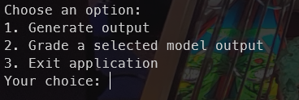
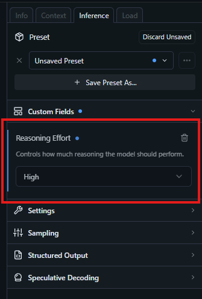
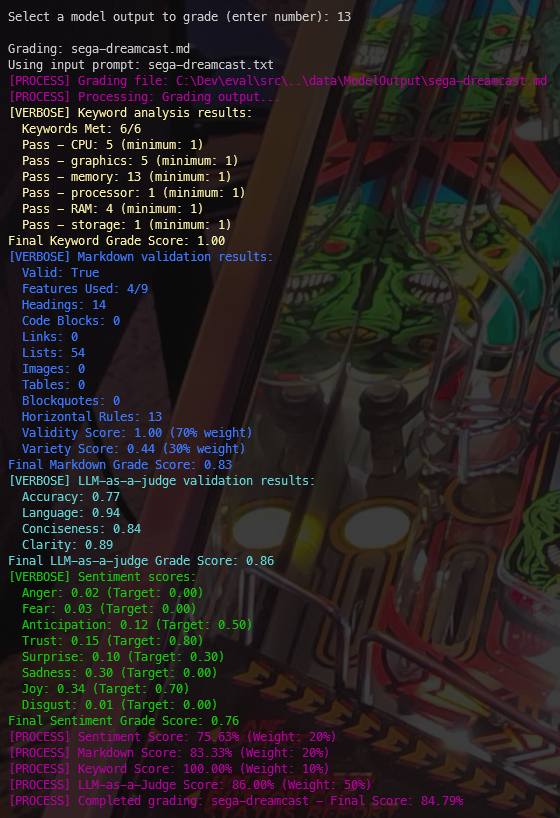

# Eval

## :movie_camera: Background

Anthropic's [Building with the Claude API](https://anthropic.skilljar.com/claude-with-the-anthropic-api) training course covers the concept of prompt evaluation. After completing the course I wanted to build a simple framework for evaluating the output of locally running LLMs.

This software uses various graders to evaluate model output. The software is a tool which should be configured, tuned and extended as needed to provide the necessary evaluation; the tool is not a one-size-fits-all solution for evaluating the quality and suitability of model output across domains and use cases.

This tool is particularly useful when utilising frontier models to evaluate the output of older, less capable or smaller models. This would be useful in scenarios where system prompts need to be refined to be used with affordable models in production to generate more predictable outputs.

## :white_check_mark: Scope

- [x] Console based UI for executing framework functions.
- [x] Integration with local LLMs.
- [x] Function for creating model outputs based on system prompts and user prompts.
- [x] Function framework for passing model output into evaluation pipeline.
- [x] Keyword grader.
- [x] Markdown grader.
- [x] Sentiment grader.
- [x] LLM-as-a-judge-grader.

## :telescope: Future Gazing

- [ ] Improve support for [harmony](https://github.com/openai/harmony).
- [ ] Ensure tool is highly flexible and can be configured for extensive use cases through config files.

## :beetle: Known Defects

No known defects.

## :crystal_ball: Use of AI
[GitHub Copilot](https://github.com/features/copilot) was used to assist in the development of this software.

## :rocket: Getting Started

### :computer: System Requirements

#### Software

> [!NOTE]
> Other operating systems and versions will work, where versions are specified treat as minimums.

#### Hardware

A system capable of running LM Studio is required.

Details of my personal system are below.

> [!NOTE]
> The hardware in use on my PC includes an Accelerated Processor Unit (APU) which combines CPU and GPU on a single chip. Recommendations for alternative hardware can be found [here](https://lmstudio.ai/docs/app/system-requirements), performance will depend upon the models you choose to run (and other operational factors).

### :floppy_disk: System Configuration

#### LM Studio

Configure LM Studio as per the [documentation](https://lmstudio.ai/docs/app/basics).

Download:
- an appropriate frontier model for operating as a judge (I have used Open AI's [gpt-oss-120b](https://openai.com/index/introducing-gpt-oss/)),
- a selection of smaller models for generating output to evaluate.

> [!NOTE] 
> You can use [community leaderboards](https://huggingface.co/spaces/OpenEvals/find-a-leaderboard) to help select appropriate models.

Use the Developer tab to run your chosen models using the [API server](https://lmstudio.ai/docs/app/api).

> [!NOTE]
> You can use [Postman](https://www.postman.com/) to test access to the endpoints.

#### Application

The application is configured via a number of `*.settings.json` files, located here:

**/src/Config**

Suggestions when configuring the software are below.

> [!NOTE]
> Further guidance covering how the software works is available in the [Usage](#usage) section below.

`business.modeloutput.settings.json`

Configures the generation of model output for evaluation.

- When creating initial output from your system and user prompts, use a frontier model.
- When the evaluation framework is configured, change the model output to a smaller, simple or older (and more affordable) model.

`business.outputgrading.settings.json`

Configures the general output grading settings (each individual grader has a dedicated configuration file).

- The application of weights is entirely down to the domain, use case and defined acceptable parameters.
- I have chosen to apply higher weighting to LLM-as-a-judge.
- How you choose to weight your graders will depend on your goals, tolerances, use case, domain etc.

`grading.keyword.settings.json`

Configures the keyword grader.

- Keywords will be specific to your domain.
- I have avoided being too prescriptive with my expectations.
- Your use case may need the presence of more specific keywords.

`grading.llmasajudge.settings.json`

Configures the LLM-as-a-judge grader.

- Ensure you have a collection of high quality frontier model outputs for evaluation by the judge.
- I would recommend that you use the largest and most capable frontier model available for evaluation purposes.

`grading.markdown.settings.json`

Configures the markdown grader.

- I have valued validity much higher than variety for my specific example use case.
- Variety may be important for your use case, depending on how the output will be displayed, the anticipated audience and the content's purpose.

`grading.sentiment.settings.json`

Configures the sentiment grader.

- Each sentiment score is a value between 0.0 and 1.0.
- Consider the audience and purpose of the content.
- I would recommend that you use the largest and most capable frontier model available for sentiment analysis.

`infrastructure.chatcompletion.settings.json`

Configures the chat completion integration.

- These settings specify how the software communicates with your locally running LLMs.
- The settings I have included are the default settings for LM Studio.

### :wrench: Development Setup

Clone the repository.

Open in Visual Studio code.

Build the projects.

## :zap: Features

- Generation of model output using system prompt and user prompts, via locally running LLMs.
- Selection of model output for evaluation via the evaluation pipeline.
- Keyword grader, checking for presence of predefined keywords.
- Markdown grader, checking validity and quality of markdown format.
- Sentiment grader, checking for appropriate emotional language and structure.
- LLM as a judge grader, using frontier models to evaluate the overall quality of alternative model output.
- Logging and presentation of an evaluation score, for iterative improvement of prompts.

## :paperclip: Usage

### Generate high quality model output

The first step is to generate model output which is to be evaluated by the software.

Design a system prompt for generating your output and store within the following directory:

**/data/SystemPrompts**

Create a collection of user prompts which will be used in combination with the system prompt above to generate your output, and store them here:

**/data/InputPrompts**

Configure the following file appropriately:

`business.modeloutput.settings.json`

Run LM Studio and load your frontier model.

Run the evaluation software, you will be presented with the following options:

Select 1 to generate model outputs.

The software will use your configured system prompt and user prompts to create the output.

> [!NOTE]
> The software currently assumes markdown format for its output.

The output will be saved to the following location:

**/data/ModelOutput**

Review the output, update your system prompt and user prompts and rerun the generation until the output is of a high quality.

> [!NOTE] 
> The aim is to generate output using more capable frontier models which meet the quality standards you require.
> You will use this output as part of the evaluation pipeline, comparing it to the output of smaller, less capable models under evaluation.

### Configure the graders

Each grader has a dedicated `*.settings.json` file.

See the above [Application](####application) section for details of each configuration file.

> [!NOTE]
> You will need to tweak these settings and iterate your evaluations to establish an optimum pipeline configuration for your specific domain and use case.

### Load your evaluation frontier model, configure with appropriate settings.

Load your frontier model via LM Studio.

Ensure that a large context window is configured and that GPU offload is configured for optimum performance:

Setting the model's reasoning effort to high results in more detailed analysis of the model output by the evaluation pipeline:

### Run the evaluation pipeline

You can now run the evaluation pipeline.

Start the software and select option 2 from the menu:

The software will list all model outputs previously generated, ready for evaluation.

Select a model output, the evaluation pipeline will execute.

You will be presented with detailed analysis:

> [!NOTE]
> At this stage you may wish to tweak your grader configuration and rerun the evaluation. This depends on your specific domain and use case, and where value is found within the model output.

> [!NOTE]
> Once you are happy with the evaluation and you believe it accurately measures the quality you are aiming for within the model output, take note of the evaluation scores.
> These scores will represent the target you are willing to accept for high quality output, you are aiming to generate model output as close to these scores as possible.

### Reconfigure model output to use smaller, less capable model

At this point you can reconfigure your model output to be generated using a smaller model.

Configure the following file appropriately:

`business.modeloutput.settings.json`

> [!NOTE]
> As a reminder, the benefit of using a frontier model up until this point is to generate high quality model output and to configure the evaluation pipeline to recognise value in the text.
> Once the pipeline itself has been tested, iterated and evaluated for quality you can switch to generate output using a smaller, less capable model which is cheaper to operate in a production environment.

### Generate new model output, ready for evaluation

Using the existing system prompt and user prompts, regenerate your output.

### Run the evaluation pipeline using newly generated content

Run the evaluation pipeline over your newly generated content.

Review the output. If the score is lower than hoped, consider how the system prompt can be updated.

Using the logged output to guide your updates tweak the system prompt to be more specific, to provide better examples, to emphasize important properties of the output etc.

### Iterate system prompt and user prompt updates

Continue to generate model output and iterate your evaluation and updates to the system prompt until you reach an acceptable evaluation score.

> [!NOTE]
> You may not be able to achieve the same score as your frontier model when using your smaller models. Consider what an acceptable score would be.

## :wave: Contributing

This repository was created primarily for my own exploration of the technologies involved.

## :gift: License

I have selected an appropriate license using [this tool](https://choosealicense.com/).

This software is licensed under the [MIT](LICENSE) license.

## :book: Further reading

More detailed information can be found in the documentation:
* [Resources](docs/Resources.md)